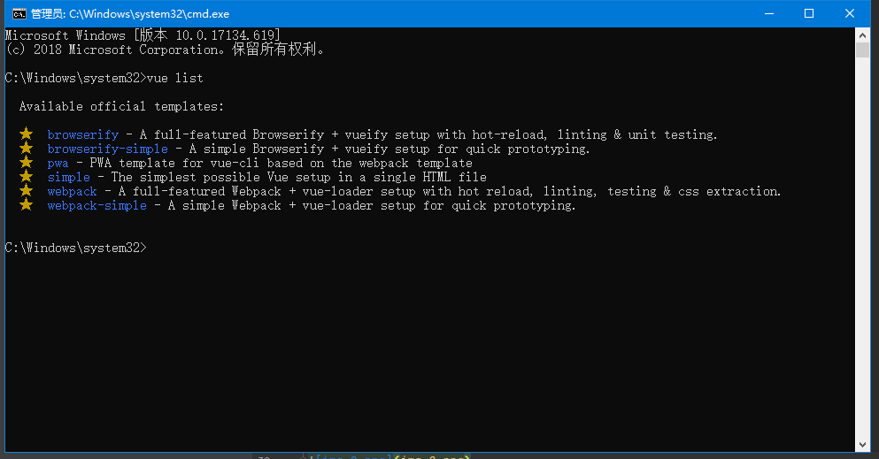

# vue-cli脚手架开发

# vue-router 路由跳转

# vuex状态管理，管理会话

# vue UI （elementUI ，ICE）

`基础标签`

# v-if
# v-else
# v-else-if
# v-bind ：
# v-on   @ 
# v-model 
# v-for

# axios通信

# 安装node.js

# 安装淘宝镜像 npm install cnpm -g 

# 安装vue-cli  cnpm install vue-cli -g

# vue list 
